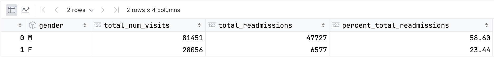
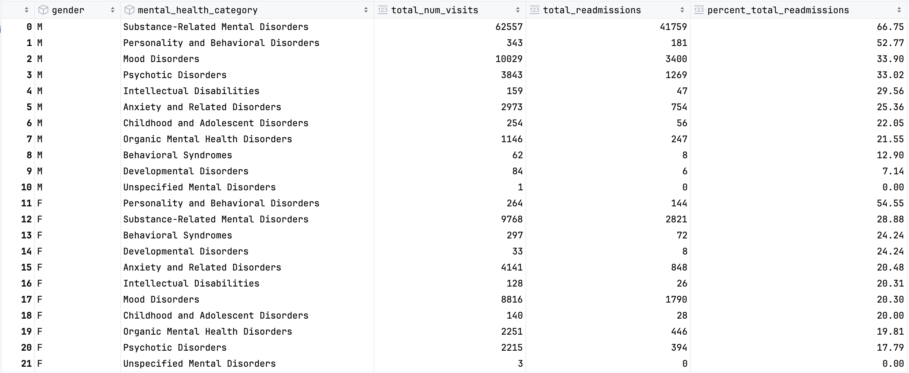
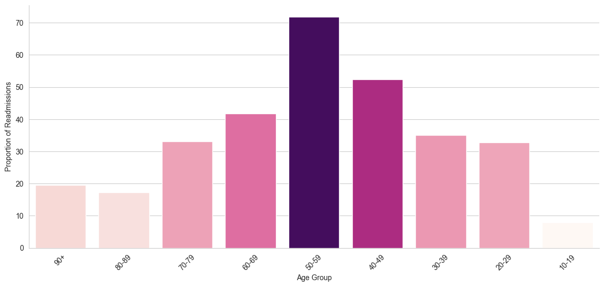
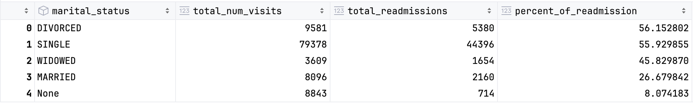
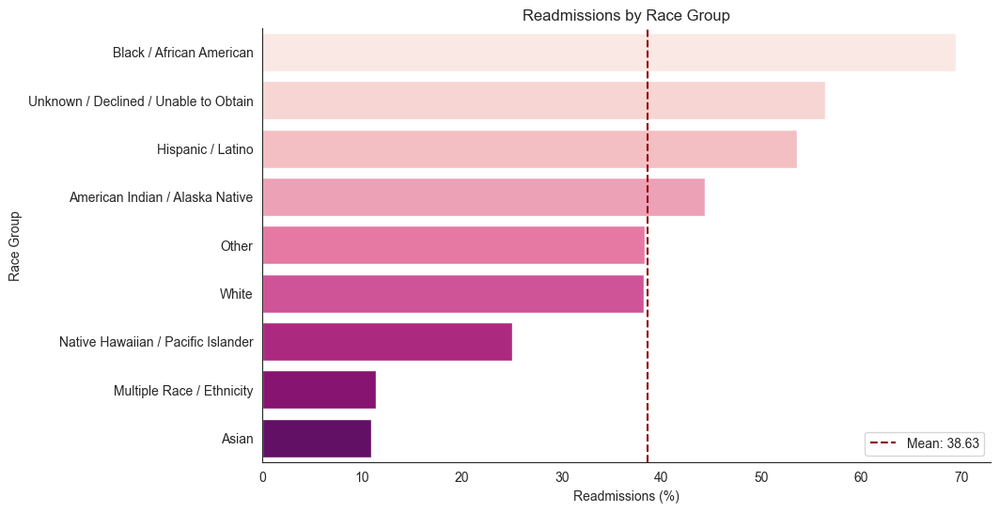
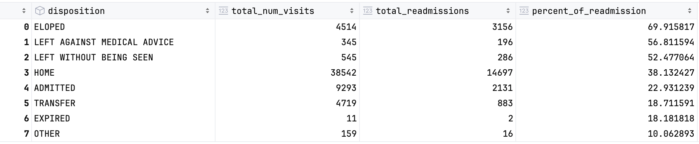
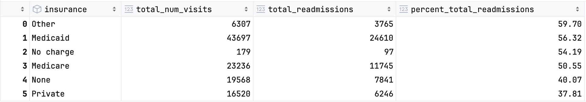
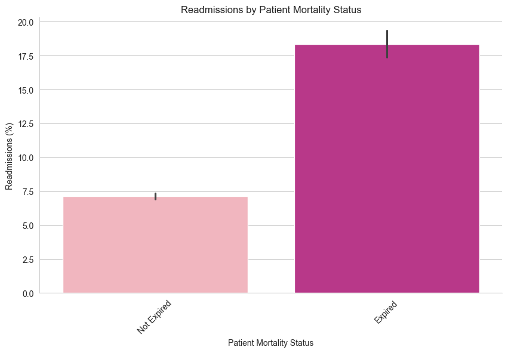

📓 **Jupyter Notebook:**  
Explore the full analysis in the notebook here:  
[Readmission Rate Analysis.ipynb](./Readmission%20Rate%20Analysis.ipynb)


## **Project Introduction**

Since I’ve began my journey into the data science field, I’ve been driven by one question: how can we use data to improve mental health outcomes? That curiosity has led me to explore healthcare quality frameworks, specifically SEPTEE(Safety, Effectiveness, Patient-centeredness, Timeliness, Efficiency, Equity).

Using these dimensions, I identified readmission rates as a key indicator. Prior research has shown high readmission rates lead to resource strain, higher mortality risk, increased patient and hospital costs.

This led me to my primary research question: Do patients with mental health diagnoses face higher 30-day readmission rates than those with non-mental health diagnoses in the Emergency Department (ED)?

To answer this question I analyzed 450K ED visits from the Beth Israel MIMIC-IV dataset (10 years of de-identified patient data), using BigQuery SQL for data querying and Python for statistical testing and visualization.

---

## **Objectives**

- Analyze patterns and disparities in emergency department readmissions related to mental health diagnoses across demographic factors
- Identify key risk factors contributing to high readmission and mortality rates to inform data-driven recommendations for improved care.

---

## **Tools**

- Python
    - (`Pandas, Matplotlib, Seaborn`) for data cleaning and exploratory data analysis (EDA)
    - `StatsModels` for statistical testing
- BigQuery SQL
    - Used to query and extract the data

---

## Data Description

- **Sources**:
    - [MIMIC-IV](https://mimic.mit.edu/docs/about/) Emergency Department (ED) dataset, filtered to include mental health-related admissions.
- **Key variables**:
    - ***stay_id***: An identifier which uniquely identifies a single emergency department stay for a single patient.
    - ***subject_id***: a unique identifier which specifies an individual patient.
    - ***gender***: The patient’s administrative gender as documented in the hospital system.
    - ***anchor_age***: is the patient’s age in the `anchor_year`. If a patient’s `anchor_age` is over 89 in the `anchor_year` then their `anchor_age` is set to 91, regardless of how old they actually were.
    - ***age_group***: Binned age groups
    - ***dod***: The de-identified date of death for the patient.
    - ***seq_num***: A pseudo-priority for the diagnosis. A `seq_num` of 1 usually indicates a “primary” diagnosis
    - ***icd_code***: A coded diagnosis using the International Classification of Diseases (ICD) ontology.
    - **race**: The patient’s self-reported race. Race is aggregated into higher level categories for very small groups.
    - ***race_group***: Aggregation of races into larger groups
    - ***arrival_transport***: The method through which the individual arrived at the ED. A count of the possible entries is provided below.
    - ***disposition***: The method through which the individual left the ED.
    - ***name_medication***: The name of any current medications the patient was taking on admission

- **Size**:
    - MIMIC-IV contains data from 2008-2019
    - Analyzed 457,823 amount of rows max
- Table Modification:
    
    ### 1. Diagnosis Category Mapping
    
    - Creates broad mental health vs. non–mental health flags by mapping ICD-9/ICD-10 codes to categories.
        
        ```python
        
        -- icd-10 code info: https://www.icd10data.com/ICD10CM/Codes/F01-F99
        -- icd-9  code info: https://en.wikipedia.org/wiki List_of_ICD-9_codes_290%E2%80%93319:_mental_disorders
        SELECT 
        *,
          CASE
              WHEN mental_health_category IN ('Childhood and Adolescent',
                                              'Unspecified Mental Disorders',
                                              'Organic Mental Health Disorders',
                                              'Substance-Related Mental Disorders',
                                              'Psychotic Disorders',
                                              'Mood Disorders',
                                              'Anxiety and Related Disorders',
                                              'Behavioral Syndromes',
                                              'Personality and Behavioral Disorders',
                                              'Intellectual Disabilities',
                                              'Developmental Disorders',
                                              'Childhood and Adolescent Disorders',
                                              'Unspecified Mental Disorders') THEN 1
              ELSE 0 
          END AS is_mh_disorder -- Flag whether a diagnosis is a mental health disorder
        FROM
        (SELECT 
          ed.subject_id,
          ed.stay_id,
          icd_code,
          seq_num,
          icd_version,
          icd_title,
          CASE 
                -- Organic Mental Health Disorders
                WHEN LEFT(icd_code, 3) IN ('290', '293', '294', 'F01','F06','F07', 'F02', 'F03', 'F04', 'F05','F09') THEN 'Organic Mental Health Disorders'
        
                -- Substance-Related Mental Disorders
                WHEN LEFT(icd_code, 3) IN ('303', '291', '292', '304', '305', 'F10', 'F11', 'F12', 'F13', 'F14', 'F15', 'F16', 'F17', 'F18', 'F19') THEN 'Substance-Related Mental Disorders'
        
                -- Psychotic Disorders
                WHEN LEFT(icd_code, 3) IN ('295', '297', '298', 'F20', 'F21', 'F22', 'F23', 'F24', 'F25', 'F28', 'F29') THEN 'Psychotic Disorders'
        
                -- Mood Disorders
                WHEN LEFT(icd_code, 3) IN ('296', '311', 'F30', 'F31', 'F32', 'F33', 'F34', 'F39') THEN 'Mood Disorders'
        
                -- Anxiety and Related Disorders
                WHEN LEFT(icd_code, 3) IN ('300', 'F40', 'F41', 'F42', 'F43', 'F44', 'F45', 'F48') THEN 'Anxiety and Related Disorders'
        
                -- Behavioral Syndromes
                WHEN LEFT(icd_code, 3) IN ('305', 'F50', 'F51', 'F52', 'F53', 'F54', 'F55') THEN 'Behavioral Syndromes'
        
                -- Personality and Behavioral Disorders
                WHEN LEFT(icd_code, 3) IN ('301', 'F60', 'F61', 'F62', 'F63', 'F64', 'F65', 'F66', 'F68', 'F69') THEN 'Personality and Behavioral Disorders'
        
                -- Intellectual Disabilities
                WHEN LEFT(icd_code, 3) IN ('317', '318', '319', 'F70', 'F71', 'F72', 'F73', 'F74', 'F75', 'F79') THEN 'Intellectual Disabilities'
        
                -- Developmental Disorders
                WHEN LEFT(icd_code, 3) IN ('299', '313', 'F80', 'F81', 'F82', 'F83', 'F84', 'F85', 'F88', 'F89') THEN 'Developmental Disorders'
        
                -- Childhood and Adolescent Disorders
                WHEN LEFT(icd_code, 3) IN ('312', '313', 'F90', 'F91', 'F92', 'F93', 'F94', 'F95', 'F98') THEN 'Childhood and Adolescent Disorders'
        
                -- Unspecified Mental Disorders
                WHEN LEFT(icd_code, 3) IN ('290', '299', 'F99') THEN 'Unspecified Mental Disorders'
        
                ELSE 'Non-MH-Disorder'
          END AS mental_health_category
        FROM `physionet-data.mimiciv_ed.diagnosis` AS d
        
        LEFT JOIN
          `physionet-data.mimiciv_ed.edstays` AS ed
        ON
          ed.stay_id = d.stay_id)
        ```
        

### 2. Readmission Cohort Construction

- Builds a CTE to pair each index visit (initial visit before readmission) with any subsequent ED visit within 1–30 days, then flags index stays and readmissions.
    
    ```python
    -- Discharge-to-Admit 
    WITH readmissions AS (
      SELECT 
        a.subject_id,
        a.stay_id AS index_stay_id,         -- First visit
        a.intime AS index_admit,
        a.outtime AS index_discharge,
        b.stay_id AS readmit_stay_id,       -- Readmission visit
        b.intime AS readmit_admit,
        b.outtime AS readmit_discharge,
        DATE_DIFF(b.intime, a.outtime, DAY) AS days_between
      FROM `physionet-data.mimiciv_ed.edstays` AS a
      JOIN `physionet-data.mimiciv_ed.edstays` AS b
        ON a.subject_id = b.subject_id
        AND a.stay_id != b.stay_id          -- Avoid self-matching
        AND b.intime > a.outtime            -- Ensure it's after discharge
        AND DATE_DIFF(b.intime, a.outtime, DAY) <= 30  -- Within 30 days
        AND DATE_DIFF(b.intime, a.outtime, DAY) > 0    -- Exclude same-day overlaps
    )
    
    SELECT 
      DISTINCT(ed.stay_id) AS stay_id,
      ed.subject_id,
      ed.hadm_id,
      r.readmit_stay_id,
      EXTRACT(DATE FROM intime) AS edadmitdate, -- admission date
      EXTRACT(HOUR FROM intime) AS edadmithour, -- admission hour
      EXTRACT(DATE FROM outtime) AS eddischargedate, -- discharge date
      EXTRACT(HOUR FROM outtime) AS eddischargehour, -- discharge hour
      DATE_DIFF(outtime,intime,hour) AS LOS_hr, -- length of stay in hours
      r.days_between AS days_to_readmission,
    
     -- Flag if this stay was followed by a readmission (index stay)
      CASE
        WHEN ed.stay_id IN (SELECT index_stay_id FROM readmissions) THEN 1
        ELSE 0
      END AS had_readmission_within_30,
    
      -- Flag if this stay IS a readmission
      CASE
        WHEN ed.stay_id IN (SELECT readmit_stay_id FROM readmissions) THEN 1
        ELSE 0
      END AS is_readmission,
      
      arrival_transport,
      disposition
    FROM `physionet-data.mimiciv_ed.edstays` AS ed
    LEFT JOIN
      readmissions AS r
    ON
      ed.stay_id = r.readmit_stay_id
    WHERE intime < outtime
    ORDER BY subject_id ASC
    ```
    

### 3. Demographic Grouping

- Aggregates patient age into 10-year bins and creates broader race categories.

```python
SELECT 
  DISTINCT(ed.subject_id),
  ed.gender,
  p.anchor_age,
  insurance,
  marital_status,
  a.language,
  CASE
    WHEN p.anchor_age BETWEEN 0 AND 9 THEN '0-9'
    WHEN p.anchor_age BETWEEN 10 AND 19 THEN '10-19'
    WHEN p.anchor_age BETWEEN 20 AND 29 THEN '20-29'
    WHEN p.anchor_age BETWEEN 30 AND 39 THEN '30-39'
    WHEN p.anchor_age BETWEEN 40 AND 49 THEN '40-49'
    WHEN p.anchor_age BETWEEN 50 AND 59 THEN '50-59'
    WHEN p.anchor_age BETWEEN 60 AND 69 THEN '60-69'
    WHEN p.anchor_age BETWEEN 70 AND 79 THEN '70-79'
    WHEN p.anchor_age BETWEEN 80 AND 89 THEN '80-89'
    WHEN p.anchor_age >= 90 THEN '90+'
    ELSE 'Unknown'
  END AS age_group,
  p.dod,
  CASE
    -- Broad “Asian” group
    WHEN ed.race IN (
      'ASIAN',
      'ASIAN - CHINESE',
      'ASIAN - SOUTH EAST ASIAN',
      'ASIAN - ASIAN INDIAN',
      'ASIAN - KOREAN'
    ) THEN 'Asian'
    
    -- American Indian / Alaska Native
    WHEN ed.race = 'AMERICAN INDIAN/ALASKA NATIVE' 
      THEN 'American Indian / Alaska Native'

    -- Broad “White” group (including European sub‐groups + Portuguese)
    WHEN ed.race IN (
      'WHITE',
      'WHITE - EASTERN EUROPEAN',
      'WHITE - RUSSIAN',
      'WHITE - BRAZILIAN',
      'WHITE - OTHER EUROPEAN',
      'PORTUGUESE'
    ) THEN 'White'

    -- Broad “Black/African American” group
    WHEN ed.race IN (
      'BLACK/AFRICAN AMERICAN',
      'BLACK/AFRICAN',
      'BLACK/CAPE VERDEAN',
      'BLACK/CARIBBEAN ISLAND'
    ) THEN 'Black / African American'

    -- Broad “Hispanic/Latino” group (all sub‐categories + South American)
    WHEN ed.race IN (
      'HISPANIC OR LATINO',
      'HISPANIC/LATINO - DOMINICAN',
      'HISPANIC/LATINO - PUERTO RICAN',
      'HISPANIC/LATINO - MEXICAN',
      'HISPANIC/LATINO - CENTRAL AMERICAN',
      'HISPANIC/LATINO - GUATEMALAN',
      'HISPANIC/LATINO - COLUMBIAN',
      'HISPANIC/LATINO - SALVADORAN',
      'SOUTH AMERICAN'
    ) THEN 'Hispanic / Latino'

    -- Native Hawaiian / Other Pacific Islander
    WHEN ed.race = 'NATIVE HAWAIIAN OR OTHER PACIFIC ISLANDER' 
      THEN 'Native Hawaiian / Pacific Islander'

    -- Multiple races
    WHEN ed.race = 'MULTIPLE RACE/ETHNICITY' 
      THEN 'Multiple Race / Ethnicity'

    -- Unknown / declined / unable to obtain
    WHEN ed.race IN (
      'UNKNOWN',
      'PATIENT DECLINED TO ANSWER',
      'UNABLE TO OBTAIN'
    ) THEN 'Unknown / Declined / Unable to Obtain'

    -- Everything else (e.g., code “OTHER” or any unanticipated string)
    ELSE 'Other'
  END AS race_group,
  ed.race

FROM 
  `physionet-data.mimiciv_ed.edstays` AS ed
LEFT JOIN 
  `physionet-data.mimiciv_3_1_hosp.patients` AS p
ON 
  ed.subject_id = p.subject_id
LEFT JOIN 
  `physionet-data.mimiciv_3_1_hosp.admissions` AS a
ON
  ed.subject_id = a.subject_id

ORDER BY subject_id ASC
```

---

## Key Findings

1. **Do patients with mental health diagnoses face higher 30-day readmission rates than those with non-mental health diagnoses in the Emergency Department?**
    1. Mental health related diagnoses drive readmissions in the emergency department: **Patients with a mental health conditions were readmitted nearly** **twice as often**. This points to the need for more intervention and programs aimed at reducing readmissions.
    
    
    

1.  **Which mental health diagnoses have the highest readmission rates?**
    1. Substance-Related Disorders and Personality Disorders are the leading drivers of readmission rates, with readmission levels nearly double—or more than—the overall average. Across almost all age groups, these two diagnoses consistently have the highest readmission rates. 
        
        
        
    
2. **What gender has the highest readmission rate?**
    1. More **male patients** are admitted to the ED compared to women and also have **higher overall readmission rates**. Among men, **Substance-Related Mental Health Disorders** are the leading driver of readmissions, with a rate of **67%**, followed by **Personality and Behavioral Disorders** at **53%**. In contrast, women have a **55% readmission rate** for Personality and Behavioral Disorders—**slightly higher than men**—and a significantly lower **29%** rate for Substance-Related Disorders, highlighting a **reversal in key drivers between genders**.
        
        
        
        
        
3. ***What age group has the highest readmission rate?*** 
    1. The two highest age groups with the highest proportion of readmissions were those aged **50-59 and 40-59**, with proportions of readmissions that were about **72% and 53%**, respectively. These groups have significantly different proportions compared to other groups. Notably, **patients in their 50s** with Substance-Related Disorders had the highest single age-diagnosis combination, with a **striking 78% readmission rate**. Suggesting a greater need for targeted intervention for this group.
    
    

   

    
5. **What are readmission rates by martial status? how do readmission rates differ?**
    1. All groups exhibit high rates of readmission, with the exception of patients who are married or categorized as "None", suggesting that individuals with partner support may be at lower risk of returning to the emergency department. **Partnership may act as protective factor against negative health outcomes.**
        
        
        
6. **What are the readmission rates by racial group?**
    1. Groups above the mean readmission rate indicate potential disparities amongst patients from certain backgrounds. These disparities may be tied to various factors such as cultural barriers or socioeconomic background. 
    
    
    
7. **Which discharge outcome is linked to higher readmission rates?**
    1. Patients who leave the emergency department before receiving adequate treatment are more likely to experience higher readmission rates. Patients may leave for various reasons such as long wait times, so its crucial to understand the reasons patients leave without care.
    
    
    

1. **What type of insurance is associated with higher rates of readmission?**
    1. Insurance types, except for those indicating 'None' and 'Private,' had high readmission rates, with those indicating 'Other' having the highest. Meanwhile, patients with private insurance had the lowest readmission rates, which could indicate a correlation with socioeconomic status. 
    
    
    

1. **Is there an association between high readmission rates and patient mortality?**
    1. Patients who died had significantly more readmissions than those who survived, suggesting an association between the two. This warrants further investigation to determine whether deaths are linked to the ED processes. Given this connection, reducing readmission rates may help lower patient mortality.
    
    
    

## Results

1. **Research Question:** Do patients with mental health diagnoses face higher 30-day readmission rates than those with non-mental health diagnoses in the Emergency Department?
    
    **Where:**
    
    - $\alpha$ = 0.05
    - $p_1$: proportion of MH-Disorder patients readmitted
    - $p_2$: proportion of Non-MH-Disorder patients readmitted
    
    **Hypotheses:**
    
    - $H_0: p_1 ≤ p_2$
    - $H_1: p_1 > p_2$
    
    ```sql
    from statsmodels.stats.proportion import proportions_ztest
    
    num_readmitted_mh = MH_disorders_vs_Non_MHM_Disorder.iloc[1]['total_readmissions']
    num_readmitted_non_mh = MH_disorders_vs_Non_MHM_Disorder.iloc[0]['total_readmissions']
    total_admissions_mh = MH_disorders_vs_Non_MHM_Disorder.iloc[1]['total_num_visits']
    total_admissions_non_mh = MH_disorders_vs_Non_MHM_Disorder.iloc[0]['total_num_visits']
    
    successes = [num_readmitted_mh, num_readmitted_non_mh]
    observations = [total_admissions_mh, total_admissions_non_mh]
    
    # One-tailed test: H1: p1 > p2
    stat, pval = proportions_ztest(count=successes, nobs=observations, alternative='larger')
    ```
    
    - z-statistic: 193.6980317974423, p-value: 0.0
    
    ```python
    
    # Test of effect size for the magnitude of the significane level
    from statsmodels.stats.proportion import proportion_effectsize
    
    p1_MH = MH_disorders_vs_Non_MHM_Disorder.iloc[1]['percent_total_readmissions']/100
    p2_Non_MH = MH_disorders_vs_Non_MHM_Disorder.iloc[0]['percent_total_readmissions']/100
    
    effect_size = proportion_effectsize(p1_MH,p2_Non_MH)
    ```
    
    - Effect Size (Cohen's h): 0.5530
    - Approximately 49% of emergency department admissions for mental health issues were readmissions, compared to only about 23% for non-mental health-related admissions. To test the significance of these results, a one-tailed proportion z-test indicated that patients diagnosed with a mental health disorder have significantly higher readmission rates compared to those diagnosed with a non-mental health-related disorder (z = 193.70, p = 0.0). The effect size was moderate (Cohen’s h = 0.55), suggesting that the observed difference is not only statistically significant but also practically meaningful in the healthcare context. This indicates that even a small reduction in readmission rates in patients diagnosed with a mental health disorder could have an impact on the overall readmission rate and have broader implications such reducing financial impact to the hospital and patient.
2. **Research Question:** Do patients that have died have a higher readmission rate compared to those who have not died?
    
    **Where:**
    
    - $\alpha$ = 0.05
    - $p_1$: proportion of readmissions among patients who have died
    - $p_2$: proportion of readmissions among patients that have not died
    
    **Hypotheses:**
    
    - $H_0: p_1 ≤ p_2$
    - $H_1: p_1 > p_2$
    
    ```python
    num_readmitted_expired = readmission_rates_and_mortality.iloc[1]['total_readmissions']
    num_readmitted_not_expired = readmission_rates_and_mortality.iloc[0]['total_readmissions']
    total_admissions_expired = readmission_rates_and_mortality.iloc[1]['total_visits']
    total_admissions_non_expired = readmission_rates_and_mortality.iloc[0]['total_visits']
    
    successes = [num_readmitted_expired, num_readmitted_not_expired]
    observations = [total_admissions_expired, total_admissions_non_expired]
    
    # One-tailed test: H1: p1 > p2
    stat, pval = proportions_ztest(count=successes, nobs=observations, alternative='larger')
    print(f'z-statistic: {stat}, p-value: {pval}'
    ```
    
    - z-statistic: 2.060378919112351, p-value: 0.019681165304425843
    
    ```python
    p1_expired = readmission_rates_and_mortality.iloc[1]['percent_total_readmissions'] / 100
    p2_non_expired = readmission_rates_and_mortality.iloc[0]['percent_total_readmissions'] / 100
    
    effect_size = proportion_effectsize(p1_expired, p2_non_expired)
    
    print(f"Effect Size (Cohen's h): {effect_size:.4f}")
    ```
    
    - Effect Size (Cohen's h): 0.9903
    - A one-tailed proportion z-test indicated that patients who died had significantly higher readmission rates compared to those who survived (z = 2.06, p = 0.019). The effect size was high (Cohen’s h = 0.99), suggesting that the difference is not only statistically significant but also potentially meaningful in a clinical context. These findings suggest an association between higher readmission rates and mortality. However, further research is necessary to understand the underlying causes of mortality and whether reducing readmissions could impact patient survival.
    

---

## Recommendations

1. **Target High-Risk Mental Health Diagnoses**
    1. Implement targeted discharge planning and follow-up care for patients with substance-related and behavioral disorders such as scheduled calls and patient medication management education.
    2. Ensure adequate hand-offs to behavioral health programs .
2. **Demographic Specific Support Programs**
    1. Develop peer-support networks or community health outreach focused on unmarried or single men aged 40–59.
    2. Incorporate mental health check-ins as part of follow-up protocols for this demographic.
3. **Address Racial Disparities**
    1. Conduct further analysis to identify root causes of higher readmission rates among certain racial/ethnic groups by surveying patients about specific and perceived barriers to care.
    2. Develop tailored interventions to improve care engagement and outcomes.
4. **Reduce Patients Leaving Without Treatment**
    1. Investigate root causes of patients leaving the ED without being seen, such as long wait times, lack of communication, or unclear expectations.
    2. Ensure early patient engagement by having staff initiate contact immediately upon arrival, even if clinical care is delayed.
5. **Collect and Leverage Socioeconomic Data**
    1. Begin tracking income, employment status, housing stability, and other social determinants of health. Use this data to design equity-focused interventions and improve access to care.
6. **Investigate Readmission-Mortality Link**
    1. Explore whether care coordination factors are contributing to increased mortality. Use findings to refine care transition protocols and prevent avoidable adverse outcomes.
    2. Collect data on hospital related complications.

---

## **Limitations**

- Socioeconomic status was not measured in this project.
- Length of stay wasn’t included as a study variable.
- ICD codes were aggregated into broad categories rather than examined at a granular level.
- Data were collected from a single hospital, limiting the generalizability of findings.
- Only 30 day admissions were included. Readmissions beyond 30 days were not captured, limiting analyzing longer-term outcomes.

---

## Sources

- Dhaliwal JS, Dang AK. Reducing Hospital Readmissions. [Updated 2024 Jun 7]. In: StatPearls [Internet]. Treasure Island (FL): StatPearls Publishing; 2025 Jan-. Available from: https://www.ncbi.nlm.nih.gov/books/NBK606114/
- Six Domains of Healthcare Quality. Content last reviewed March 2025. Agency for Healthcare Research and Quality, Rockville, MD. https://www.ahrq.gov/talkingquality/measures/six-domains.html
- Johnson, A., Bulgarelli, L., Pollard, T., Gow, B., Moody, B., Horng, S., Celi, L. A., & Mark, R. (2024). *MIMIC-IV (version 3.1)*. PhysioNet. [**https://doi.org/10.13026/kpb9-mt58**](https://doi.org/10.13026/kpb9-mt58)

---

### **Next Steps**
