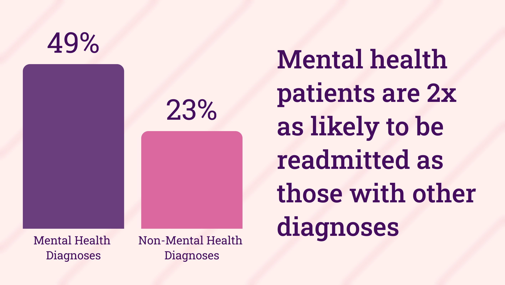

## **Project Summary**

- This project investigates the risk factors associated with high readmission rates in the Emergency Department (ED) for patients diagnosed with a mental health condition. High readmission rates are indicative of poor operational performance and are often linked to increased patient mortality, hospital-acquired conditions, higher patient costs, overcrowding, and a greater overall burden on the healthcare system. By analyzing readmission data, this project aims to identify the key risk factors contributing to higher readmission rates.

---

## **Objectives**

- Compare admission rates between mental health diagnoses and other medical conditions.
- Investigate the relationship between readmission rates and  mortality.
- Identify which mental health diagnoses have the highest readmission rates.
- Examine disparities in readmission rates across racial, age, and gender groups.
- Explore the interaction between marital status and readmission rates.
- Investigate diagnoses with the highest readmission rates.
- Provide data-driven recommendations to reduce readmission rates.

---

## **Tools**

- Python
    - (`Pandas, Matplotlib, Seaborn`) for data cleaning and exploratory data analysis (EDA)
    - `StatsModels` for statistical testing
- BigQuery SQL
    - Used to query and extract the data

---

## Data Description

- **Sources**:
    - [MIMIC-IV](https://mimic.mit.edu/docs/about/) Emergency Department (ED) dataset, filtered to include mental health-related admissions.
- **Key variables**:
    - ***stay_id***: An identifier which uniquely identifies a single emergency department stay for a single patient.
    - ***subject_id***: a unique identifier which specifies an individual patient.
    - ***gender***: The patient’s administrative gender as documented in the hospital system.
    - ***anchor_age***: is the patient’s age in the `anchor_year`. If a patient’s `anchor_age` is over 89 in the `anchor_year` then their `anchor_age` is set to 91, regardless of how old they actually were.
    - ***age_group***: Binned age groups
    - ***dod***: The de-identified date of death for the patient.
    - ***seq_num***: A pseudo-priority for the diagnosis. A `seq_num` of 1 usually indicates a “primary” diagnosis
    - ***icd_code***: A coded diagnosis using the International Classification of Diseases (ICD) ontology.
    - **race**: The patient’s self-reported race. Race is aggregated into higher level categories for very small groups.
    - ***race_group***: Aggregation of races into larger groups
    - ***arrival_transport***: The method through which the individual arrived at the ED. A count of the possible entries is provided below.
    - ***disposition***: The method through which the individual left the ED.
    - ***name_medication***: The name of any current medications the patient was taking on admission

- **Size & scope**:
    - MIMIC-IV contains data from 2008-2019
    - Analyzed 457,823 amount of rows max

---

## Data Cleaning & Preprocessing

1. **Readmission Identification**
- Built a `readmissions` CTE from the `edstays` table to link each index ED visit (`index_stay_id`) with any subsequent visit (`readmit_stay_id`) for the same patient occurring 1–30 days after discharge.
- Filtered out self-matches and same-day overlaps to ensure true readmissions.
- Flagged each record with:
    - `had_readmission_within_30` (index stays followed by a readmission)
    - `is_readmission` (visits that are themselves readmissions)
- SQL Query
    
    ```sql
    -- Discharge-to-Admit 
    WITH readmissions AS (
      SELECT 
        a.subject_id,
        a.stay_id AS index_stay_id,         -- First visit
        a.intime AS index_admit,
        a.outtime AS index_discharge,
        b.stay_id AS readmit_stay_id,       -- Readmission visit
        b.intime AS readmit_admit,
        b.outtime AS readmit_discharge,
        DATE_DIFF(b.intime, a.outtime, DAY) AS days_between
      FROM `physionet-data.mimiciv_ed.edstays` AS a
      JOIN `physionet-data.mimiciv_ed.edstays` AS b
        ON a.subject_id = b.subject_id
        AND a.stay_id != b.stay_id          -- Avoid self-matching
        AND b.intime > a.outtime            -- Ensure it's after discharge
        AND DATE_DIFF(b.intime, a.outtime, DAY) <= 30  -- Within 30 days
        AND DATE_DIFF(b.intime, a.outtime, DAY) > 0    -- Exclude same-day overlaps
    )
    
    SELECT 
      DISTINCT(ed.stay_id) AS stay_id,
      ed.subject_id,
      ed.hadm_id,
      r.readmit_stay_id,
      EXTRACT(DATE FROM intime) AS edadmitdate, -- admission date
      EXTRACT(HOUR FROM intime) AS edadmithour, -- admission hour
      EXTRACT(DATE FROM outtime) AS eddischargedate, -- discharge date
      EXTRACT(HOUR FROM outtime) AS eddischargehour, -- discharge hour
      DATE_DIFF(outtime,intime,hour) AS LOS_hr, -- length of stay in hours
      r.days_between AS days_to_readmission,
    
     -- Flag if this stay (index stay) was followed by a readmission 
      CASE
        WHEN ed.stay_id IN (SELECT index_stay_id FROM readmissions) THEN 1
        ELSE 0
      END AS had_readmission_within_30,
    
      -- Flag if this stay IS a readmission (readmission stay)
      CASE
        WHEN ed.stay_id IN (SELECT readmit_stay_id FROM readmissions) THEN 1
        ELSE 0
      END AS is_readmission,
      
      arrival_transport,
      disposition
    FROM `physionet-data.mimiciv_ed.edstays` AS ed
    LEFT JOIN
      readmissions AS r
    ON
      ed.stay_id = r.readmit_stay_id
    WHERE intime < outtime
    ORDER BY subject_id ASC
    ```
    
1. **Demographics & Grouping**
- Joined `edstays` with `patients` and `admissions` tables to assemble patient demographics.
- Created standardized categories:
    - **Age** in 10-year bins (0–9, 10–19, …, 90+)
    - **Race/Ethnicity** consolidated into broad groups (e.g., White, Black/African American, Hispanic/Latino, Asian, Other)
- SQL Query
    
    ```sql
    SELECT 
      DISTINCT(ed.subject_id),
      ed.gender,
      p.anchor_age,
      insurance,
      marital_status,
      a.language,
      CASE
        WHEN p.anchor_age BETWEEN 0 AND 9 THEN '0-9'
        WHEN p.anchor_age BETWEEN 10 AND 19 THEN '10-19'
        WHEN p.anchor_age BETWEEN 20 AND 29 THEN '20-29'
        WHEN p.anchor_age BETWEEN 30 AND 39 THEN '30-39'
        WHEN p.anchor_age BETWEEN 40 AND 49 THEN '40-49'
        WHEN p.anchor_age BETWEEN 50 AND 59 THEN '50-59'
        WHEN p.anchor_age BETWEEN 60 AND 69 THEN '60-69'
        WHEN p.anchor_age BETWEEN 70 AND 79 THEN '70-79'
        WHEN p.anchor_age BETWEEN 80 AND 89 THEN '80-89'
        WHEN p.anchor_age >= 90 THEN '90+'
        ELSE 'Unknown'
      END AS age_group,
      p.dod,
      CASE
        -- Broad “Asian” group
        WHEN ed.race IN (
          'ASIAN',
          'ASIAN - CHINESE',
          'ASIAN - SOUTH EAST ASIAN',
          'ASIAN - ASIAN INDIAN',
          'ASIAN - KOREAN'
        ) THEN 'Asian'
        
        -- American Indian / Alaska Native
        WHEN ed.race = 'AMERICAN INDIAN/ALASKA NATIVE' 
          THEN 'American Indian / Alaska Native'
    
        -- Broad “White” group (including European sub‐groups + Portuguese)
        WHEN ed.race IN (
          'WHITE',
          'WHITE - EASTERN EUROPEAN',
          'WHITE - RUSSIAN',
          'WHITE - BRAZILIAN',
          'WHITE - OTHER EUROPEAN',
          'PORTUGUESE'
        ) THEN 'White'
    
        -- Broad “Black/African American” group
        WHEN ed.race IN (
          'BLACK/AFRICAN AMERICAN',
          'BLACK/AFRICAN',
          'BLACK/CAPE VERDEAN',
          'BLACK/CARIBBEAN ISLAND'
        ) THEN 'Black / African American'
    
        -- Broad “Hispanic/Latino” group (all sub‐categories + South American)
        WHEN ed.race IN (
          'HISPANIC OR LATINO',
          'HISPANIC/LATINO - DOMINICAN',
          'HISPANIC/LATINO - PUERTO RICAN',
          'HISPANIC/LATINO - MEXICAN',
          'HISPANIC/LATINO - CENTRAL AMERICAN',
          'HISPANIC/LATINO - GUATEMALAN',
          'HISPANIC/LATINO - COLUMBIAN',
          'HISPANIC/LATINO - SALVADORAN',
          'SOUTH AMERICAN'
        ) THEN 'Hispanic / Latino'
    
        -- Native Hawaiian / Other Pacific Islander
        WHEN ed.race = 'NATIVE HAWAIIAN OR OTHER PACIFIC ISLANDER' 
          THEN 'Native Hawaiian / Pacific Islander'
    
        -- Multiple races
        WHEN ed.race = 'MULTIPLE RACE/ETHNICITY' 
          THEN 'Multiple Race / Ethnicity'
    
        -- Unknown / declined / unable to obtain
        WHEN ed.race IN (
          'UNKNOWN',
          'PATIENT DECLINED TO ANSWER',
          'UNABLE TO OBTAIN'
        ) THEN 'Unknown / Declined / Unable to Obtain'
    
        -- Everything else (e.g., code “OTHER” or any unanticipated string)
        ELSE 'Other'
      END AS race_group,
      ed.race
    
    FROM 
      `physionet-data.mimiciv_ed.edstays` AS ed
    LEFT JOIN 
      `physionet-data.mimiciv_3_1_hosp.patients` AS p
    ON 
      ed.subject_id = p.subject_id
    LEFT JOIN 
      `physionet-data.mimiciv_3_1_hosp.admissions` AS a
    ON
      ed.subject_id = a.subject_id
    
    ORDER BY subject_id ASC
    ```
    
1.  **Diagnosis Mapping & Flagging**
- Merged ED stays with `diagnosis` records and mapped ICD-9/ICD-10 codes via `LEFT(icd_code, 3)` to mental health categories (mood, anxiety, psychotic, substance-related, etc.).
- Introduced `is_mh_disorder` (binary) to flag any mental health–related diagnosis.
- SQL Query
    
    ```sql
    -- icd-10 code info: https://www.icd10data.com/ICD10CM/Codes/F01-F99
    -- icd-9  code info: https://en.wikipedia.org/wiki List_of_ICD-9_codes_290%E2%80%93319:_mental_disorders
    SELECT 
    *,
      CASE
          WHEN mental_health_category IN ('Childhood and Adolescent',
                                          'Unspecified Mental Disorders',
                                          'Organic Mental Health Disorders',
                                          'Substance-Related Mental Disorders',
                                          'Psychotic Disorders',
                                          'Mood Disorders',
                                          'Anxiety and Related Disorders',
                                          'Behavioral Syndromes',
                                          'Personality and Behavioral Disorders',
                                          'Intellectual Disabilities',
                                          'Developmental Disorders',
                                          'Childhood and Adolescent Disorders',
                                          'Unspecified Mental Disorders') THEN 1
          ELSE 0 
      END AS is_mh_disorder -- Flag whether a diagnosis is a mental health disorder
    FROM
    (SELECT 
      ed.subject_id,
      ed.stay_id,
      icd_code,
      seq_num,
      icd_version,
      icd_title,
      CASE 
            -- Organic Mental Health Disorders
            WHEN LEFT(icd_code, 3) IN ('290', '293', '294', 'F01','F06','F07', 'F02', 'F03', 'F04', 'F05','F09') THEN 'Organic Mental Health Disorders'
    
            -- Substance-Related Mental Disorders
            WHEN LEFT(icd_code, 3) IN ('303', '291', '292', '304', '305', 'F10', 'F11', 'F12', 'F13', 'F14', 'F15', 'F16', 'F17', 'F18', 'F19') THEN 'Substance-Related Mental Disorders'
    
            -- Psychotic Disorders
            WHEN LEFT(icd_code, 3) IN ('295', '297', '298', 'F20', 'F21', 'F22', 'F23', 'F24', 'F25', 'F28', 'F29') THEN 'Psychotic Disorders'
    
            -- Mood Disorders
            WHEN LEFT(icd_code, 3) IN ('296', '311', 'F30', 'F31', 'F32', 'F33', 'F34', 'F39') THEN 'Mood Disorders'
    
            -- Anxiety and Related Disorders
            WHEN LEFT(icd_code, 3) IN ('300', 'F40', 'F41', 'F42', 'F43', 'F44', 'F45', 'F48') THEN 'Anxiety and Related Disorders'
    
            -- Behavioral Syndromes
            WHEN LEFT(icd_code, 3) IN ('305', 'F50', 'F51', 'F52', 'F53', 'F54', 'F55') THEN 'Behavioral Syndromes'
    
            -- Personality and Behavioral Disorders
            WHEN LEFT(icd_code, 3) IN ('301', 'F60', 'F61', 'F62', 'F63', 'F64', 'F65', 'F66', 'F68', 'F69') THEN 'Personality and Behavioral Disorders'
    
            -- Intellectual Disabilities
            WHEN LEFT(icd_code, 3) IN ('317', '318', '319', 'F70', 'F71', 'F72', 'F73', 'F74', 'F75', 'F79') THEN 'Intellectual Disabilities'
    
            -- Developmental Disorders
            WHEN LEFT(icd_code, 3) IN ('299', '313', 'F80', 'F81', 'F82', 'F83', 'F84', 'F85', 'F88', 'F89') THEN 'Developmental Disorders'
    
            -- Childhood and Adolescent Disorders
            WHEN LEFT(icd_code, 3) IN ('312', '313', 'F90', 'F91', 'F92', 'F93', 'F94', 'F95', 'F98') THEN 'Childhood and Adolescent Disorders'
    
            -- Unspecified Mental Disorders
            WHEN LEFT(icd_code, 3) IN ('290', '299', 'F99') THEN 'Unspecified Mental Disorders'
    
            ELSE 'Non-MH-Disorder'
      END AS mental_health_category
    FROM `physionet-data.mimiciv_ed.diagnosis` AS d
    
    LEFT JOIN
      `physionet-data.mimiciv_ed.edstays` AS ed
    ON
      ed.stay_id = d.stay_id
    
    )
    ```
    

---

## Key Findings

- Mental health-related diagnoses are associated with significantly higher readmission rates than non-mental health diagnoses.
- Substance-related disorders and personality/behavioral disorders are the leading contributors to readmissions.
- Patients aged 40–59, especially unmarried men, are disproportionately represented in readmission cases.
- Race and ethnicity are correlated with elevated readmission rates, indicating potential disparities in care or access.
- Patients who leave the emergency department before receiving adequate treatment are more likely to experience higher readmission rates.
- Socioeconomic factors—such as insurance status, employment, and housing—likely play a role but require more data.
- A notable association between readmission and mortality suggests that readmission may be a proxy for inadequate care or discharge planning.

## Results

1. **Research Question:** Are readmission rates among patients diagnosed with some mental health disorder significantly higher than those of patients not diagnosed with a mental health disorder?
    
    **Where:**
    
    - $\alpha$ = 0.05
    - $p_1$: proportion of MH-Disorder patients readmitted
    - $p_2$: proportion of Non-MH-Disorder patients readmitted
    
    **Hypotheses:**
    
    - $H_0: p_1 ≤ p_2$
    - $H_1: p_1 > p_2$
    
    ```sql
    from statsmodels.stats.proportion import proportions_ztest
    
    num_readmitted_mh = MH_disorders_vs_Non_MHM_Disorder.iloc[1]['total_readmissions']
    num_readmitted_non_mh = MH_disorders_vs_Non_MHM_Disorder.iloc[0]['total_readmissions']
    total_admissions_mh = MH_disorders_vs_Non_MHM_Disorder.iloc[1]['total_num_visits']
    total_admissions_non_mh = MH_disorders_vs_Non_MHM_Disorder.iloc[0]['total_num_visits']
    
    successes = [num_readmitted_mh, num_readmitted_non_mh]
    observations = [total_admissions_mh, total_admissions_non_mh]
    
    # One-tailed test: H1: p1 > p2
    stat, pval = proportions_ztest(count=successes, nobs=observations, alternative='larger')
    ```
    
    - z-statistic: 197.6443080104927, p-value: 0.0
    
    ```python
    
    # Test of effect size for the magnitude of the significane level
    from statsmodels.stats.proportion import proportion_effectsize
    
    p1_MH = MH_disorders_vs_Non_MHM_Disorder.iloc[1]['percent_total_readmissions']/100
    p2_Non_MH = MH_disorders_vs_Non_MHM_Disorder.iloc[0]['percent_total_readmissions']/100
    
    effect_size = proportion_effectsize(p1_MH,p2_Non_MH)
    ```
    
    - Effect Size (Cohen's h): 0.5714
    - Approximately 50% of emergency department admissions for mental health issues were readmissions, compared to only about 23% for non-mental health-related admissions. To test the significance of these results, a one-tailed proportion z-test indicated that patients diagnosed with a mental health disorder have significantly higher readmission rates compared to those diagnosed with a non-mental health-related disorder (z = 197.64, p < 0.05). The effect size was moderate (Cohen’s h = 0.57), suggesting that the observed difference is not only statistically significant but also practically meaningful in the healthcare context. This indicates that even a small reduction in readmission rates in patients diagnosed with a mental health disorder could have an impact on the overall readmission rate and have broader implications such reducing financial impact to the hospital and patient.
2. **Research Question:** Do patients that have died have a higher readmission rate compared to those who have not died?
    
    **Where:**
    
    - $\alpha$ = 0.05
    - $p_1$: proportion of readmissions among patients who have died
    - $p_2$: proportion of readmissions among patients that have not died
    
    **Hypotheses:**
    
    - $H_0: p_1 ≤ p_2$
    - $H_1: p_1 > p_2$
    
    ```python
    num_readmitted_expired = readmission_rates_and_mortality.iloc[1]['total_readmissions']
    num_readmitted_not_expired = readmission_rates_and_mortality.iloc[0]['total_readmissions']
    total_admissions_expired = readmission_rates_and_mortality.iloc[1]['total_visits']
    total_admissions_non_expired = readmission_rates_and_mortality.iloc[0]['total_visits']
    
    successes = [num_readmitted_expired, num_readmitted_not_expired]
    observations = [total_admissions_expired, total_admissions_non_expired]
    
    # One-tailed test: H1: p1 > p2
    stat, pval = proportions_ztest(count=successes, nobs=observations, alternative='larger')
    print(f'z-statistic: {stat}, p-value: {pval}'
    ```
    
    - z-statistic: 1.9231436277010432, p-value: 0.027231007282238293
    
    ```python
    p1_expired = readmission_rates_and_mortality.iloc[1]['percent_total_readmissions'] / 100
    p2_non_expired = readmission_rates_and_mortality.iloc[0]['percent_total_readmissions'] / 100
    
    effect_size = proportion_effectsize(p1_expired, p2_non_expired)
    
    print(f"Effect Size (Cohen's h): {effect_size:.4f}")
    ```
    
    - Effect Size (Cohen's h): 0.5195
    - A one-tailed proportion z-test indicated that patients who died had significantly higher readmission rates compared to those who survived (z = 1.92, p < 0.05). The effect size was moderate (Cohen’s h = 0.52), suggesting that the difference is not only statistically significant but also potentially meaningful in a clinical context. These findings suggest an association between higher readmission rates and mortality. However, further research is necessary to understand the underlying causes of mortality and whether reducing readmissions could impact patient survival.
    

---

## Recommendations

1. **Target High-Risk Mental Health Diagnoses**
    1. Implement targeted discharge planning and follow-up care for patients with substance-related and behavioral disorders. 
    2. Consider specialized care transfers or integrated behavioral health programs.
2. **Demographic Specific Support Programs**
    1. Develop peer-support networks or community health outreach focused on unmarried or single men aged 40–59.
    2. Incorporate mental health check-ins as part of follow-up protocols for this demographic.
3. **Address Racial Disparities**
    1. Conduct further analysis to identify root causes of higher readmission rates among certain racial/ethnic groups.
    2. Develop tailored interventions to improve care engagement and outcomes.
4. **Reduce Patients Leaving Without Treatment**
    1. Investigate root causes of patients leaving the ED without being seen, such as long wait times, lack of communication, or unclear expectations.
    2. Ensure early patient engagement by having staff initiate contact immediately upon arrival, even if clinical care is delayed
5. **Collect and Leverage Socioeconomic Data**
    1. Begin tracking income, employment status, housing stability, and other social determinants of health. Use this data to design equity-focused interventions and improve access to care.
6. **Investigate Readmission-Mortality Link**
    1. Explore whether care coordination factors are contributing to increased mortality. Use findings to refine care transition protocols and prevent avoidable adverse outcomes.

---

## **Limitations**

- Socioeconomic status was not measured in this project.
- Time-and-trend analyses were not performed; such analyses could help identify periods of ED overcrowding.
- Length of stay was included as a study variable.
- ICD codes were aggregated into broad categories rather than examined at a granular level.
- Data were collected from a single hospital, limiting the generalizability of findings.
- Only 30 day admissions were included. Readmissions beyond 30 days were not captured, limiting analyzing longer-term outcomes.
